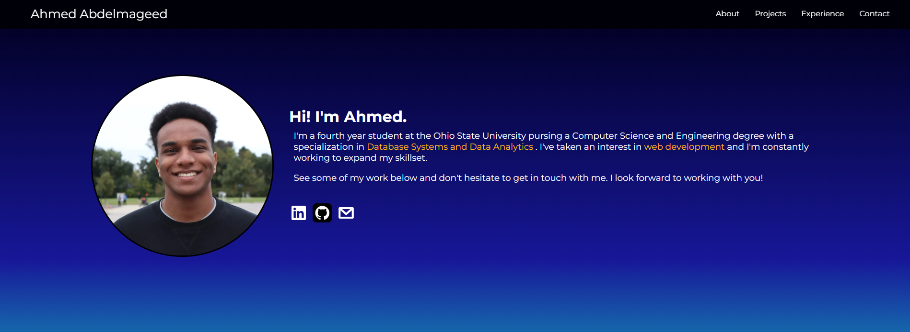

# Portfolio

Personal portfolio showcasing development experience: https://ahmed-mgd.netlify.app.
Created using plain HTML/CSS and Astro for static site generation.


## Installation and Usage

1. Clone the repository and navigate to the directory. Run:
```bash 
npm install
```
2. To start the site in a development environment: 
```bash 
npm run dev
```

## Lessons Learned

- Configuring Astro and using components
- Practice with responsive web design
